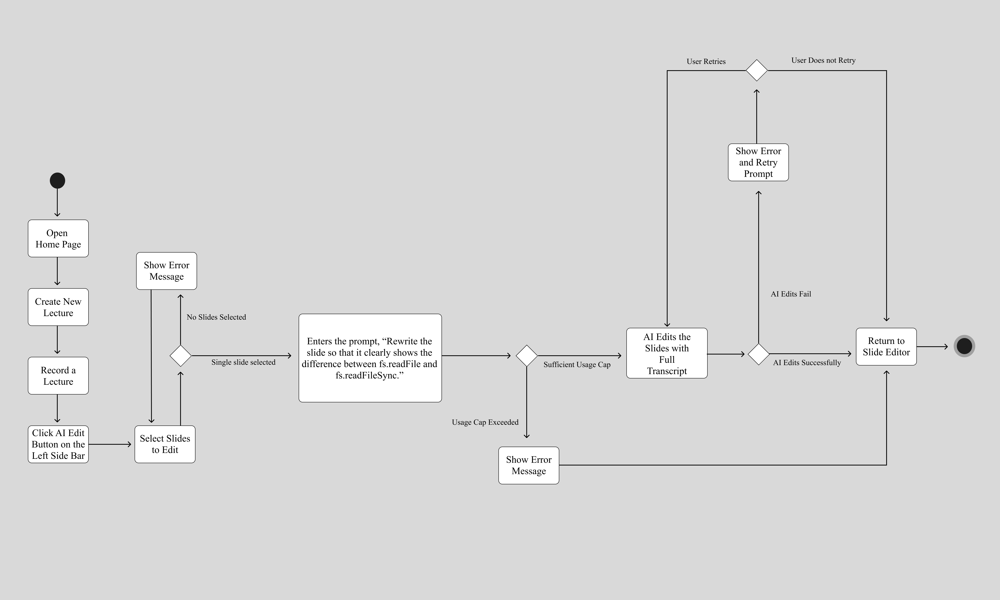
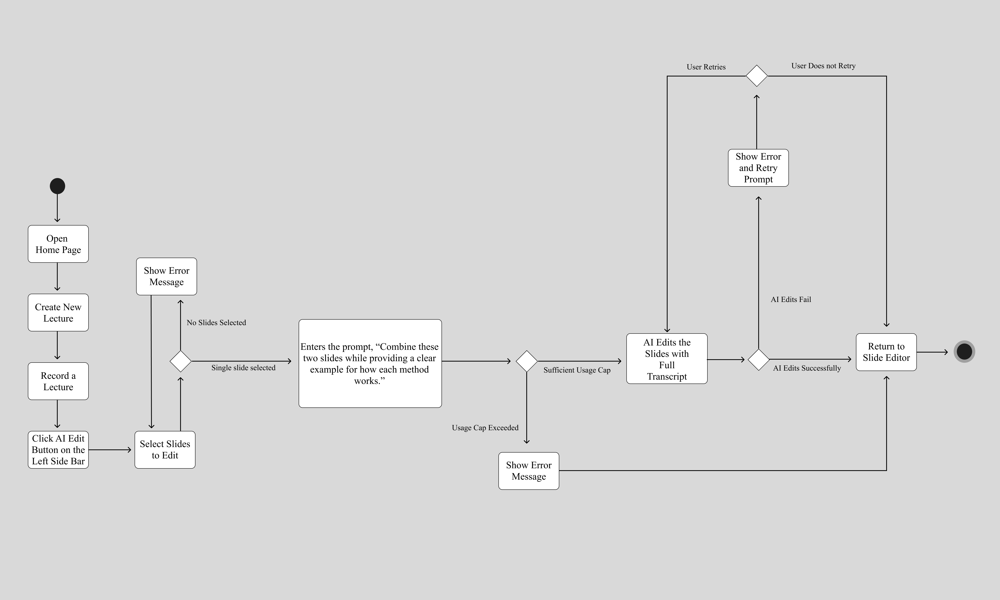
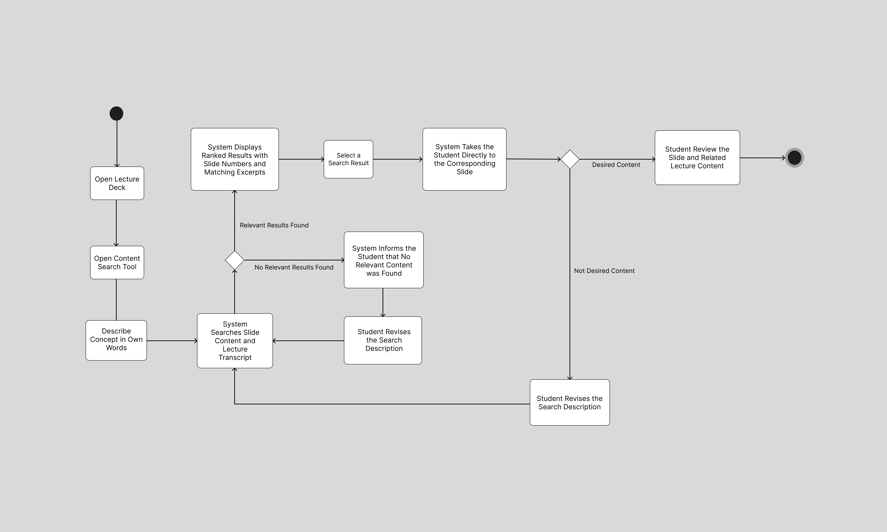
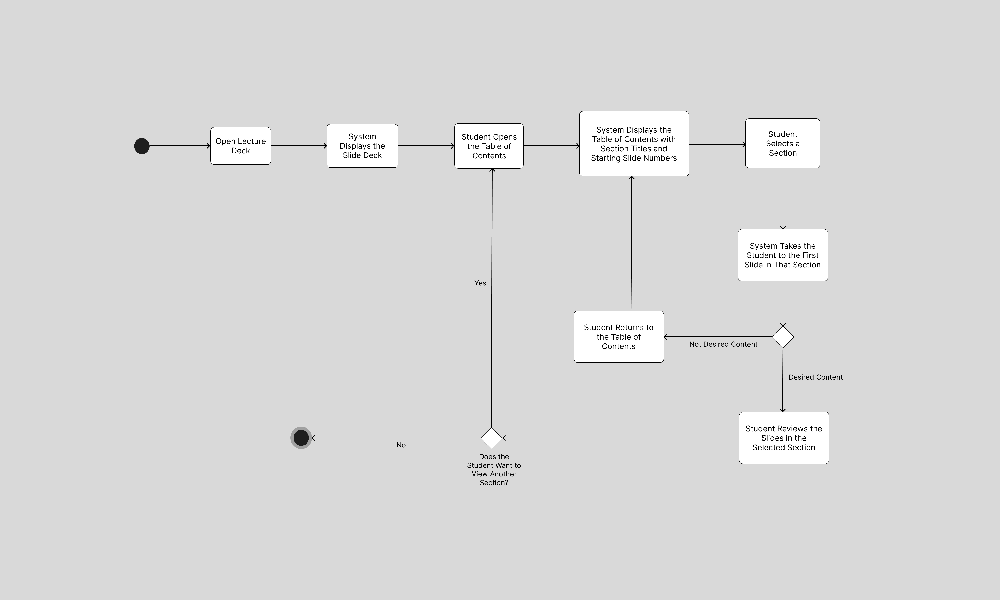

# Specification Phase Exercise

A little exercise to get started with the specification phase of the software development lifecycle. In this exercise, your team specifies a set of improvements and new features for [The Slide Machine](https://theslidemachine.com) — see the [instructions](instructions.md) for detail, and the [background](background.md) for an introduction to the software product you are tasked with extending.

## Team members

- [Yihyun Nam](https://github.com/iindes)
- [Kathy Lin](https://github.com/lkykathy)
- [Ben Zaslavsky](https://github.com/benzaslavsky)
- [Sara Herschmann](https://github.com/saramhersch)
- [Anthony Wang](https://github.com/aw4580)

## Review of the Current Application

### **Strengths**

- The system captured a personal story introduced during the lecture and generated a slide about it even though it was not included in the original lecture outline.
- The exit-ticket quiz reflected what was actually discussed during the lecture, including more specific or niche topics.
- The generated deck generally followed the progression of the lecture well.
- The platform was well organized, with major controls located in intuitive places. A first-time user was generally able to find the necessary controls without navigating through multiple screens.
- The system accurately identified concepts that received particular emphasis during the lecture. For example, emphasizing that Python lists begin at index zero resulted in a slide specifically about list indexing.
- The generated slides generally separated major topic transitions appropriately and summarized the main concepts of the lecture accurately.
- Generated slide titles generally captured the main point of each lecture segment, making the completed deck easier to understand and review.
- The exit-ticket quiz covered the major concepts that the instructor expected students to learn, even though the questions did not explore those concepts in significant depth.

### **Weaknesses**

- Rapid speech sometimes caused portions of the lecture to be missed or transcribed inaccurately.
- Rapid speech also affected slide segmentation, causing some slide breaks to occur at inappropriate points.
- The generated quiz questions sometimes felt generic and similar to questions that could be produced solely from the completed slide deck rather than from the full lecture context.
- Some useful examples and contextual information from the spoken lecture were omitted from the generated slides, so the deck captured the main ideas but not all of the useful supporting detail.
- Some exit-ticket questions were repetitive and tested essentially the same concept. The quiz also focused primarily on basic recall rather than application of the lecture material.
- Slide generation sometimes lagged one or two slides behind the instructor's speech, making it unclear whether the instructor should continue speaking or pause for the system to catch up.
- Related concepts were not always grouped appropriately. In one case, four parallel concepts that would have been clearer together were separated across multiple slides.
- Equivalent concepts were formatted inconsistently. Some concepts received separate subtitle slides while another concept at the same level did not.
- The generated transcript was occasionally inaccurate or did not align with the content shown on the corresponding slide.
- Some automatically selected images were only loosely related to the slide content and could be confusing without additional explanation.
- Narration playback preserved unusually long pauses and rapid changes in speaking speed rather than presenting the content at a clear and consistent pace.
- The **Play deck aloud** feature did not always update its narration after the user switched to a different slide.
- Some slides contained only a title even though the associated narration included substantial information that could have been represented visibly on the slide.
- The purpose and behavior of some controls, including sharing and voting controls, were not immediately clear to first-time users.
- The **Share** button did not provide clear feedback indicating whether an action had successfully occurred.
- Some subtitle slides added little useful information and interrupted the flow of the deck when it was reviewed as study material.

### **Gaps**
- The slide editor did not provide sufficient manual control for correcting generated content, such as reliably removing unwanted text boxes.
- Long decks lacked efficient navigation tools such as slide numbers in list view, a section-based table of contents, or concept-aware search.
- There was no clear way for students to search a lecture deck by describing a concept or idea when they did not know the exact wording used on the slides.
- Students could not readily find a way to download the generated slides for offline review or use in another format.
- The shared deck viewer offered limited tools specifically designed for studying completed lectures, such as transcript-based review, notes, highlighting, or condensed study materials.

## Prior Art & Originality

We reviewed the Slide Machine Software Design Document, including its Future Work and Open Questions, the delivery roadmap, and the repository's current open issues and pull requests to determine which parts of our proposal are already implemented, planned, or proposed.

Several ideas related to instructor editing already exist in the project. The current specification includes post-lecture AI refinement using the complete lecture transcript, which can reorganize content, merge or split slides, change layouts, refine narration, and be applied either to the entire lecture or to an individual slide. The roadmap indicates that this functionality has already been implemented. The project's Future Work also proposes agent-based editing that would allow users to modify upcoming or saved decks through natural-language interaction. Therefore, we do not claim transcript-aware AI refinement or AI-assisted deck editing in general as original contributions.

Our original contributions focus primarily on the student experience after a lecture. Although Slide Machine currently supports searching public decks and templates, we found no existing or planned feature for concept-aware search within an individual lecture deck. We propose allowing students to search both slide content and the lecture transcript using concepts or descriptions rather than exact wording and then jump directly to the slide most relevant to what they are looking for. We also propose section-based navigation that organizes a long generated lecture deck into meaningful sections and provides students with a table of contents for quickly moving between them. These features extend Slide Machine from simply providing students with a shared deck after class to making that deck easier to navigate, revisit, and use as study material.

We also propose a student-facing cheat-sheet workflow: students select lecture slides, include their associated transcript content, choose a page limit, preview or regenerate the concise study sheet, and download or print it. Slide Machine already supports exporting complete decks, but we found no existing or planned feature in the reviewed Software Design Document, roadmap, open issues, or pull requests for creating a condensed study document from student-selected slides. The proposed contribution is the selection-and-condensation workflow, including length control and review.

Our proposed instructor slide-selection workflow builds on Slide Machine's existing refinement capabilities rather than replacing them. It provides a more targeted interface for applying edits to a chosen set of slides, while the underlying idea of AI-assisted refinement is existing or planned work.

## Stakeholders

## Instructor Stakeholder Interviews

### Instructor 1

#### Instructor Information

- **Name:** Joe Versoza
- **User Type:** Instructor

#### Goals / Needs

- The instructor wants the purpose of The Slide Machine and its intended use case to be clear when first opening the application.
- The instructor wants clear onboarding that explains how to create a lecture and how voice input is used to generate slides.
- The instructor wants interface controls to clearly communicate what they do without requiring experimentation or outside explanation.
- The instructor wants clear feedback while AI-generated slides are being created so that they understand what the system is doing during delays.
- The instructor wants more control over how the AI generates and modifies slides.
- The instructor wants clear guardrails around AI-generated changes so that the system behaves predictably.
- The instructor wants to understand what information the AI uses and what changes it is making to the presentation.
- The instructor wants generated slides to be high enough quality that using the tool provides a meaningful advantage over preparing slides manually.

#### Problems / Frustrations

- The initial user experience was unclear, and the instructor was unsure what the application did or how to begin using it.
- The instructor did not understand the purpose of several buttons and controls because the interface provided little explanation for a first-time user.
- The instructor did not realize that speaking into the microphone was intended to generate slides and required assistance before being able to use the feature.
- The microphone became active immediately, which felt unexpected and jarring because there was little warning before recording began.
- Having two **New Lecture** buttons was confusing because the instructor could not determine whether they performed different actions.
- The application's intended use case was unclear. The instructor was unsure whether it was meant for preparing a lecture beforehand or generating slides while delivering a lecture.
- The instructor questioned the value of the application for professors who already have prepared lecture slides because the generated slides did not immediately appear better than manually prepared slides.
- Delays between speaking and slide generation were confusing because the interface did not clearly communicate what the AI was processing or whether generation was still in progress.
- A typo appeared in the application during the demonstration, which reduced the perceived polish of the product.
- The instructor was not impressed by the overall quality of some of the generated slides.
- Navigation between pages was not immediately clear.
- The purpose of controls such as the **Add Slide (+)** button was unclear.
- The instructor felt that the AI had too much control over the generated presentation and wanted more direct control over the resulting slides.

#### Observations

- The instructor required guidance before understanding the application's core speech-to-slide workflow, suggesting that the current interface assumes users already understand the product.
- The instructor repeatedly questioned what controls did, indicating that first-time-user onboarding and interface discoverability are weak.
- The instructor was uncertain whether The Slide Machine is primarily a lecture-preparation tool or a live lecture-delivery tool.
- Waiting for slide generation without detailed progress feedback made it difficult for the instructor to determine whether the system was working correctly.
- The instructor's concerns were not limited to slide quality; they also focused strongly on predictability, transparency, and control over AI-generated changes.
- The instructor wanted greater visibility into what the AI was doing rather than having the system make changes without clearly communicating its actions.
- The instructor's request for more control and guardrails supports a workflow in which instructors can deliberately select slides, specify the changes they want, and review AI-generated modifications before applying them.

## Student Stakeholder Interviews

### Student 1

#### Student Information

- **Name:** Ray
- **User Type:** Student

#### Goals / Needs

- The student wants to navigate long lecture decks efficiently and quickly locate a specific section or topic.
- The student wants an easier way to search for lecture content without manually scrolling through the entire deck.
- The student wants clear indicators of their current position within a lecture deck.
- The student wants straightforward access to downloading or exporting lecture slides for later review.
- The student wants narration controls that make spoken slide content easier to review at a comfortable pace.
- The student wants the narration and visible slide content to remain synchronized when moving between slides.
- The student wants generated slides to contain enough visible information to be useful for studying without relying entirely on narration.
- The student wants the purpose of unfamiliar interface features to be clear without having to experiment with them.

#### Problems / Frustrations

- The student could not find an option to download the slides.
- The **Share** button did not appear to do anything when the student tried to use it.
- The lecture deck was long, making it difficult and time-consuming to scroll through the presentation to find a specific section.
- Some interface controls, particularly the upvote and downvote buttons, were unclear and did not explain their purpose.
- The list view did not display slide numbers, making it difficult for the student to keep track of their position in the deck.
- Although the carousel view displayed slide numbers, it was more difficult to move quickly between distant slides.
- The student could not adjust narration speed when using **Speak the slide** or **Play deck aloud**.
- When the student moved to another slide, **Play deck aloud** did not consistently update to narrate the newly selected slide.
- Some slides contained only a title even though **Speak the slide** provided substantially more information about the topic.
- Some subtitle slides contained little useful content and interrupted the flow of reviewing the lecture.

#### Observations

- Long decks were noticeably difficult for the student to navigate using the existing scrolling and viewing options.
- The student suggested that a section-based table of contents or search tool would make it easier to locate lecture material.
- The difference between list view and carousel view created a tradeoff: list view was easier to browse, while carousel view provided slide numbers but was harder to navigate quickly.
- Narration contained useful information that was sometimes not represented visibly on the corresponding slide.

### Student 2

#### Student Information

- **Name:** 
- **User Type:** Student

#### Goals / Needs

- The student wants first-time account creation to be easy to discover and understand.
- The student wants mathematical content to display cleanly without distracting interface elements.
- The student wants microphone and speech-recognition features to support languages other than English.
- The student wants a clear and highly visible indication whenever the microphone is actively recording.
- The student wants more tools for actively studying from a lecture deck rather than only viewing its slides.
- The student wants efficient ways to navigate and search through long lecture presentations.
- The student wants easy access to downloading or exporting presentations in familiar formats for later use.
- The student wants stronger control and transparency around microphone activation and recording for privacy and safety.
- The student wants to be able to ask questions about lecture material while reviewing a deck.
- The student wants a concise summary of a long lecture that can be used for faster review.
- The student wants interactive study tools, such as practice questions or quizzes, to help check their understanding of lecture material.

#### Problems / Frustrations

- As a first-time visitor, the student did not see an obvious way to create an account from the landing page and was unsure how to get started.
- Mathematical formulas rendered clearly, but small unnecessary scrollbars appeared around some formulas and were visually distracting.
- The student could not find an obvious way to use the microphone or speech-recognition features with languages other than English.
- While recording, the microphone's active state was communicated mainly through a small tooltip, making it easy to overlook that recording was in progress.
- The shared deck viewer provided limited tools for active studying, such as access to the full lecture transcript, personal notes, or highlighting.
- The upvote and downvote controls were positioned very close to the full-screen control and could overlap it during playback.
- The purpose of the voting controls was not clearly explained.
- Scrolling through a long lecture deck felt difficult and unintuitive.
- The student could not readily find an option to download or export the presentation in a familiar format such as PDF or PowerPoint.
- Pressing the **Esc** key to close the **Add seed material** dialog unexpectedly started microphone recording without an additional warning or confirmation, creating a privacy and user-control concern.

#### Observations

- The student found the mathematical rendering itself visually strong despite the unnecessary scrollbars.
- The student expected the shared deck to function as a study resource and looked for features beyond passive slide viewing, including transcripts, notes, highlighting, summaries, and question-answering tools.
- Difficulty navigating long decks reinforced the need for alternatives to linear scrolling.
- The unexpected microphone activation was particularly concerning because the user had taken an action intended to close a dialog, not begin recording.
- The student suggested an AI lecture chatbot for asking questions about lecture content.
- The student suggested generating a shorter summary deck for reviewing the most important lecture material.
- The student expressed interest in additional quiz or practice-question tools for studying.
- The student emphasized the importance of clearer AI and user-safety protections, especially around recording status, microphone activation, and user consent.

### Common Student Needs Identified Across Interviews

The two student interviews revealed several recurring needs:

- **Better navigation for long decks:** Both students found scrolling through long presentations difficult and wanted faster ways to locate specific material.
- **Better support for studying after class:** Students wanted the generated deck to function as more than a passive presentation, with tools that help them find, review, and understand lecture content.
- **Clearer interface behavior:** Both students encountered controls whose purpose or behavior was unclear.
- **Accessible lecture content:** Students wanted easier access to lecture material through features such as search, narration, transcripts, summaries, and downloadable presentations.
- **Greater user control:** Students wanted clearer control over playback, navigation, and especially microphone and recording behavior.

## Product Vision Statement

The Slide Machine will help students revisit and study live-generated lectures through section-based navigation, concept-aware search across slide and transcript content, and customizable cheat sheets from selected material, while helping instructors make controlled AI edits to selected slides.

## User Requirements

Our proposal focuses on Content Aware Search and a Study Sheet Creator.

### Instructor
- As an instructor, I want to search across my lecture slides using normal language so that I can quickly find where I discussed a topic.
- As an instructor, I want search results to consider the lecture transcript as well as slide text so that I can find information I explained verbally.
- As an instructor, I want search results to show which slide and lecture the information came from so that I can quickly locate the original material.
- As an instructor, I want to select lecture content to include in a study sheet so that I can control what students should review.
- As an instructor, I want to generate a study sheet from selected lectures so that I can provide students with a concise review resource.
- As an instructor, I want to edit an AI-generated study sheet so that I can correct or improve it before sharing it.
- As an instructor, I want to regenerate a study sheet with different instructions so that I can adjust its level of detail or emphasis.
- As an instructor, I want to preview a study sheet before publishing it so that I can make sure it accurately represents the course material.
- As an instructor, I want to share a study sheet with students so that they can use it when preparing for assessments.
- As an instructor, I want to delete an outdated study sheet so that students do not accidentally study from obsolete material.

### Student

- As a student, I want to view the refined presentation after the lecture so that I can review what the instructor actually covered.
- As a student, I want the refined presentation to include the main ideas from the lecture so that I can use it as a reliable study resource.
- As a student, I want related concepts to appear together so that I can understand how the ideas are connected.
- As a student, I want important explanations and examples from the lecture to be preserved so that the slides remain understandable outside the live lecture.
- As a student, I want repeated information to be reduced so that I can review the presentation efficiently.
- As a student, I want the slides to follow the order of the lecture so that I can connect them to what I remember from class.
- As a student, I want the deck to be divided into clearly labeled sections so that I can understand where one topic ends and another begins.
- As a student, I want to view a table of contents organized by lecture section and jump directly to a selected section so that I can navigate a long deck without repeatedly scrolling through it.
- As a student, I want to describe a concept in my own words and be directed to the relevant slide so that I can find information without remembering the exact wording used in the deck.
- As a student, I want search results to include the matching slide number and a short relevant excerpt so that I can identify the most useful result before opening it.
- As a student, I want the search system to use both the visible slide content and the lecture transcript so that I can find material that the instructor discussed even when it was not written directly on a slide.
- As a student, I want to return easily to the table of contents or my search results after reviewing a slide so that I can continue exploring the deck without losing my place.
- As a student, I want to select multiple slides from a lecture deck so that I can choose which material should be included in a study cheat sheet.
- As a student, I want the system to use both the content of my selected slides and their associated lecture transcripts so that the cheat sheet includes important information that may have been spoken but not written on the slides.
- As a student, I want to choose the desired length or number of pages for my cheat sheet so that I can control how condensed or detailed the study material is.
- As a student, I want the system to summarize and organize the selected material into a concise cheat sheet so that I can review the most important concepts without rereading the entire lecture deck.
- As a student, I want to preview the generated cheat sheet before finalizing it so that I can make sure it includes the information I need.
- As a student, I want to change my selected slides and regenerate the cheat sheet so that I can adjust the material included without starting the process over.
- As a student, I want to regenerate the cheat sheet with a different page limit so that I can make it more concise or more detailed depending on my study needs.
- As a student, I want to download or print the generated cheat sheet so that I can use it while studying offline or preparing for an exam.
- As a student, I want the system to keep my selected slides unchanged when generating a cheat sheet so that creating study material does not modify the original lecture deck.
As a student, I want to receive a clear message if the cheat sheet cannot be generated so that I know my original lecture material has not been changed and I can try again.

## Activity Diagrams

### Instructor: Single-Slide Editing

**User story:** As an instructor, I want to select an individual slide and give the AI a specific editing instruction while allowing it to use the full lecture transcript as context so that the revised slide remains consistent with the lecture.

### Instructor: Multi-Slide Editing

**User story:** As an instructor, I want to select multiple slides and apply one AI editing instruction to all of them while allowing the system to use the full lecture transcript as context so that related slides are revised consistently.

### Student: Content-Aware Slide Search

**User story:** As a student, I want to describe a concept in my own words and be directed to the relevant slide so that I can find information without remembering the exact wording used in the deck.

### Student: Section-Based Navigation

**User story:** As a student, I want to view a table of contents organized by lecture section and jump directly to a selected section so that I can navigate a long slide deck without repeatedly scrolling through it.

## Wireframes

See instructions. Delete this line and place your wireframe diagrams here, covering every new screen and every existing screen your proposal changes, for every type of user.

## Clickable Prototype

See instructions. Delete this line and place a publicly-accessible link to your clickable prototype here.

## Stakeholder Demo

See instructions. Delete this line and place a link to the deck The Slide Machine generated during your presentation here, after you have presented.

## Exit Ticket

See instructions. Delete this line and place a link to the exit-ticket quiz you generated from your demo deck and distributed to the class, along with a short note on what — if anything — you had to correct in the generated questions before publishing.
